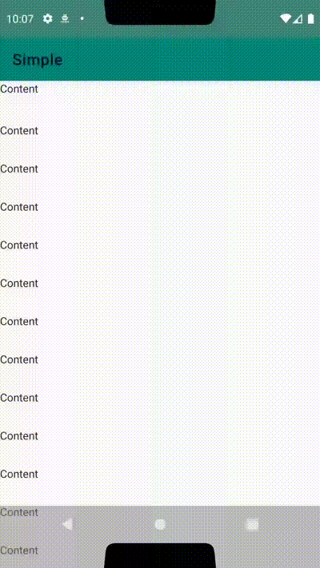
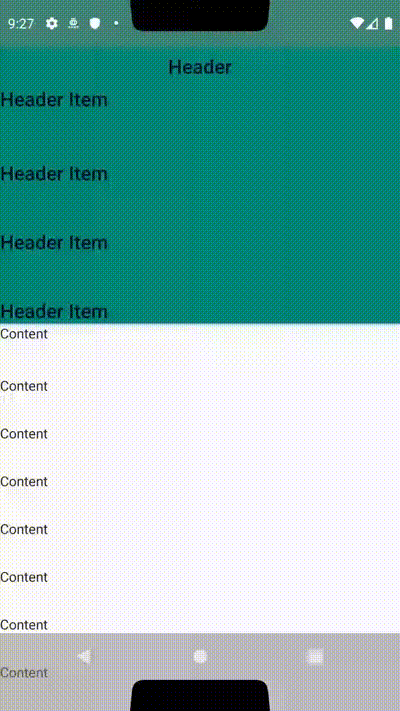
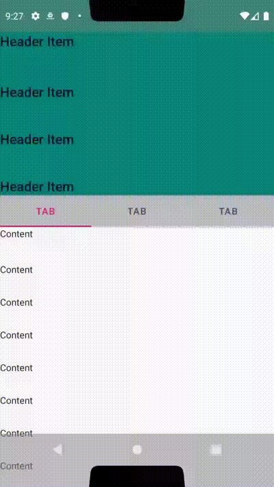
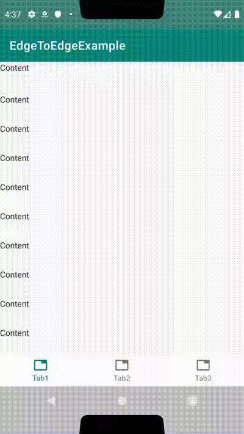
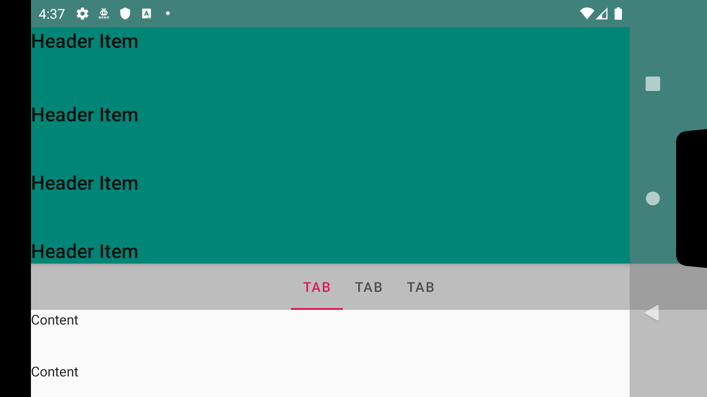
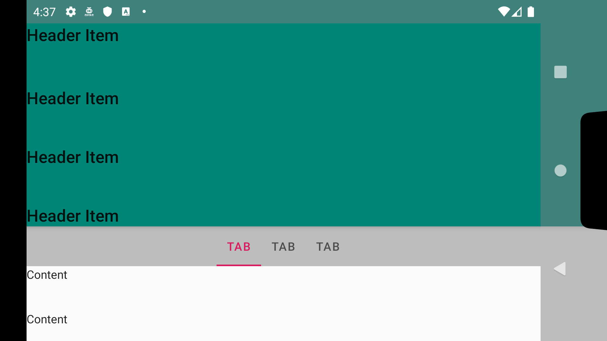

# EdgeToEdgeExample
This repository is example of Edge to Edge layout.

## Example

|Simple|Static header|
|:--:|:--:|
|||
|Sticky header|BottomNavigation|
|||

### Different of Sticky1 and Sticky2?
It's landscape device.

|Sticky1|Sticky2|
|:--:|:--:|
|||

## License
This example is under MIT License.

### Using
- [Kotlin Standard Library](https://github.com/JetBrains/kotlin/tree/master/libraries/stdlib), published by [Apache License 2.0](https://github.com/JetBrains/kotlin/tree/master/license)
- [AndroidX](https://github.com/aosp-mirror/platform_frameworks_support), published by [Apache License 2.0](https://github.com/aosp-mirror/platform_frameworks_support/blob/androidx-master-dev/LICENSE.txt)
- [Material Components](https://github.com/material-components/material-components-android), published by [Apache License 2.0](https://github.com/material-components/material-components-android/blob/master/LICENSE)
